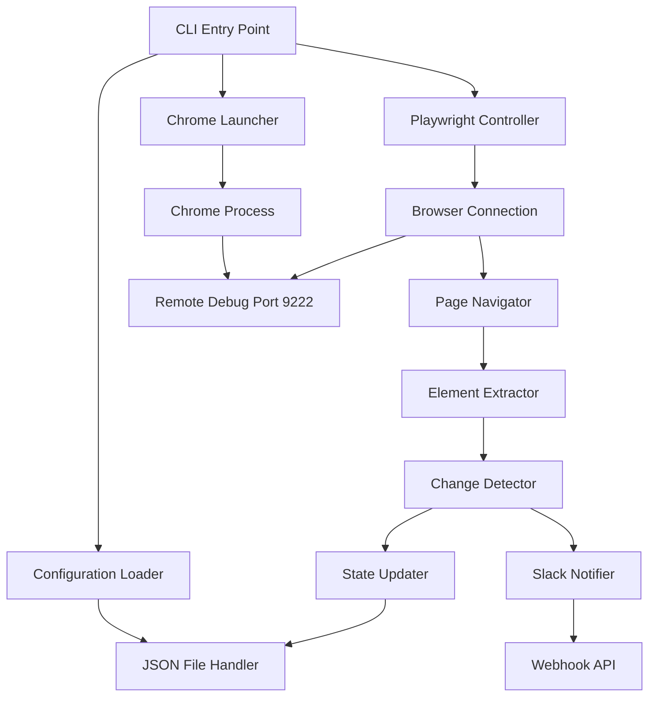

# Design Document

## Overview

The Web Element Change Detector CLI is a Node.js application that monitors web pages for changes in specific DOM elements. The tool launches a Chrome browser instance with remote debugging capabilities, connects to it using Playwright, navigates to configured web pages, extracts text content from specified CSS selectors, compares values against stored baselines, sends Slack notifications for detected changes, and updates the configuration file with new values.

The application is designed to run as a scheduled task (e.g., via cron) for continuous monitoring of dynamic web content across multiple websites.

## Architecture

### High-Level Architecture



### Component Architecture

The application follows a modular architecture with clear separation of concerns:

1. **CLI Layer**: Command-line interface and argument parsing
2. **Configuration Layer**: JSON file reading/writing and validation
3. **Browser Layer**: Chrome process management and Playwright integration
4. **Monitoring Layer**: Page navigation, element extraction, and change detection
5. **Notification Layer**: Slack webhook integration
6. **Persistence Layer**: State management and file updates

## Components and Interfaces

### 1. CLI Controller (`cli.js`)

**Responsibilities:**

- Parse command-line arguments
- Validate input parameters
- Orchestrate the monitoring workflow
- Handle top-level error handling and exit codes

**Interface:**

```javascript
class CLIController {
  async run(args)
  validateArgs(args)
  displayUsage()
  handleError(error)
}
```

### 2. Configuration Manager (`config.js`)

**Responsibilities:**

- Load and validate input.json configuration
- Save updated configuration back to file
- Validate CSS selectors and URLs

**Interface:**

```javascript
class ConfigurationManager {
  async loadConfig(filePath)
  async saveConfig(filePath, config)
  validateConfig(config)
  validateEntry(entry)
}
```

**Configuration Schema:**

```javascript
{
  url: string,           // Target webpage URL
  css_selector: string,  // CSS selector for target element
  current_value: string  // Last known value for comparison
}[]
```

### 3. Chrome Launcher (`chrome-launcher.js`)

**Responsibilities:**

- Launch Chrome with remote debugging enabled
- Check for port availability
- Manage Chrome process lifecycle
- Handle Chrome-specific errors

**Interface:**

```javascript
class ChromeLauncher {
  async launch()
  async isPortInUse(port)
  async terminate()
  getDebugUrl()
}
```

**Chrome Launch Parameters:**

- `--remote-debugging-port=9222`
- `--user-data-dir=/Volumes/CrucialX9/chrome`
- `--no-first-run`
- `--disable-default-apps`

### 4. Browser Controller (`browser-controller.js`)

**Responsibilities:**

- Connect to Chrome via Playwright's connectOverCDP
- Manage browser context and pages
- Handle browser connection errors and timeouts

**Interface:**

```javascript
class BrowserController {
  async connect(debugUrl)
  async createPage()
  async closePage(page)
  async disconnect()
}
```

### 5. Page Monitor (`page-monitor.js`)

**Responsibilities:**

- Navigate to target URLs
- Wait for and extract element content
- Handle page-specific errors and timeouts

**Interface:**

```javascript
class PageMonitor {
  async navigateAndExtract(page, url, selector)
  async waitForSelector(page, selector, timeout)
  async extractTextContent(page, selector)
  handleNavigationError(error, url)
}
```

### 6. Change Detector (`change-detector.js`)

**Responsibilities:**

- Compare extracted values with stored values
- Determine if changes occurred
- Track change metadata (timestamps, old/new values)

**Interface:**

```javascript
class ChangeDetector {
  detectChange(currentValue, storedValue)
  createChangeRecord(entry, oldValue, newValue)
}
```

**Change Record Schema:**

```javascript
{
  url: string,
  css_selector: string,
  old_value: string,
  new_value: string,
  timestamp: string,
  detected_at: Date
}
```

### 7. Slack Notifier (`slack-notifier.js`)

**Responsibilities:**

- Format change notifications for Slack
- Send webhook requests to Slack API
- Handle Slack API errors gracefully

**Interface:**

```javascript
class SlackNotifier {
  async sendChangeNotification(changeRecord)
  formatMessage(changeRecord)
  async sendWebhook(message)
}
```

**Slack Message Format:**

```
🔔 Change Detected!
• URL: https://example.com/product1
• Selector: #price
• Was: $19.99
• Now: $18.49
• Checked: 2025-07-21 11:43 AM
```

### 8. State Manager (`state-manager.js`)

**Responsibilities:**

- Update configuration with new values
- Maintain data integrity during updates
- Handle file write permissions and errors

**Interface:**

```javascript
class StateManager {
  updateConfigValues(config, changes)
  async persistConfig(filePath, updatedConfig)
  validateWritePermissions(filePath)
}
```

## Data Models

### Configuration Entry

```javascript
{
  url: string,           // Required: Target webpage URL
  css_selector: string,  // Required: CSS selector for element
  current_value: string  // Required: Stored value for comparison
}
```

### Change Detection Result

```javascript
{
  entry: ConfigEntry,    // Original configuration entry
  hasChanged: boolean,   // Whether change was detected
  oldValue: string,      // Previous stored value
  newValue: string,      // Newly extracted value
  timestamp: string,     // ISO timestamp of detection
  error?: string         // Error message if extraction failed
}
```

### Monitoring Session

```javascript
{
  configPath: string,    // Path to input configuration file
  slackWebhook?: string, // Slack webhook URL
  results: ChangeDetectionResult[], // Results for all entries
  errors: string[],      // Session-level errors
  startTime: Date,       // Session start timestamp
  endTime: Date          // Session completion timestamp
}
```

## Error Handling

### Error Categories

1. **Configuration Errors**

   - Invalid JSON format
   - Missing required fields
   - Invalid URLs or CSS selectors
   - File read/write permissions

2. **Chrome Launch Errors**

   - Port already in use
   - Chrome executable not found
   - Insufficient system resources
   - User data directory access issues

3. **Browser Connection Errors**

   - Failed to connect to Chrome debug port
   - Connection timeout
   - Browser crash or unexpected termination

4. **Page Navigation Errors**

   - Network connectivity issues
   - Page load timeouts
   - Invalid URLs
   - Server errors (4xx, 5xx)

5. **Element Extraction Errors**

   - Selector not found
   - Element timeout
   - Invalid CSS selectors
   - JavaScript execution errors

6. **Notification Errors**

   - Slack webhook failures
   - Network connectivity issues
   - Invalid webhook URL
   - Rate limiting

7. **Persistence Errors**
   - File write permissions
   - Disk space issues
   - Concurrent file access

### Error Handling Strategy

- **Graceful Degradation**: Continue processing other entries when individual entries fail
- **Detailed Logging**: Log errors with context for troubleshooting
- **User-Friendly Messages**: Provide clear error messages for common issues
- **Retry Logic**: Implement retries for transient network errors
- **Cleanup**: Ensure proper resource cleanup on errors

### Error Response Format

```javascript
{
  type: 'CONFIG_ERROR' | 'CHROME_ERROR' | 'BROWSER_ERROR' | 'PAGE_ERROR' | 'EXTRACTION_ERROR' | 'NOTIFICATION_ERROR' | 'PERSISTENCE_ERROR',
  message: string,
  details?: any,
  entry?: ConfigEntry,
  timestamp: Date
}
```

## Testing Strategy

### Unit Testing

- **Configuration Manager**: JSON parsing, validation, file I/O
- **Change Detector**: Value comparison logic, change record creation
- **Slack Notifier**: Message formatting, webhook payload construction
- **State Manager**: Configuration updates, data integrity

### Integration Testing

- **Chrome Launcher**: Process spawning, port checking, cleanup
- **Browser Controller**: Playwright connection, page management
- **Page Monitor**: Navigation, element extraction, error handling
- **End-to-End Workflow**: Complete monitoring cycle with mock data

### Error Scenario Testing

- **Network Failures**: Simulate connection timeouts, DNS failures
- **Browser Crashes**: Test recovery from unexpected browser termination
- **File System Errors**: Test handling of permission issues, disk full
- **Invalid Configurations**: Test validation and error reporting

### Performance Testing

- **Multiple Entries**: Test with large configuration files
- **Concurrent Processing**: Verify resource usage with multiple pages
- **Memory Leaks**: Long-running session memory management
- **Timeout Handling**: Verify proper timeout behavior

### Test Data Management

- **Mock Configurations**: Various valid and invalid configuration examples
- **Test Pages**: Static HTML pages with known selectors and content
- **Webhook Mocking**: Mock Slack webhook responses for testing
- **Chrome Mocking**: Mock Chrome process for unit tests

## Security Considerations

### Input Validation

- Sanitize URLs to prevent SSRF attacks
- Validate CSS selectors to prevent injection
- Limit file path access to prevent directory traversal

### Network Security

- Use HTTPS for webhook URLs when possible
- Implement request timeouts to prevent hanging connections
- Validate webhook SSL certificates

### File System Security

- Restrict file access to specified configuration files
- Validate file permissions before writing
- Use secure temporary directories for Chrome user data

### Process Security

- Run Chrome with minimal privileges
- Isolate Chrome process from main application
- Clean up temporary files and processes on exit

## Performance Considerations

### Resource Management

- **Memory Usage**: Limit concurrent page instances
- **CPU Usage**: Implement delays between page navigations
- **Network Usage**: Respect rate limits and implement backoff
- **Disk Usage**: Clean up Chrome cache and temporary files

### Optimization Strategies

- **Connection Reuse**: Reuse browser connection for multiple pages
- **Parallel Processing**: Process independent entries concurrently
- **Caching**: Cache page resources when appropriate
- **Timeout Configuration**: Configurable timeouts for different operations

### Scalability

- **Batch Processing**: Support for processing large configuration files
- **Resource Limits**: Configurable limits for concurrent operations
- **Monitoring**: Built-in performance metrics and logging
